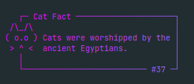
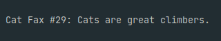

# cat-fax

Similar to Cow Say, but gives interesting and factually accurate cat facts.\
Install with `cargo install cat-fax` on any OS with rust and cargo installed\
\
On by default, will display the `cat-fax` in the terminal.\
Flags:\
`-c` or `--color` - gives colored output\
`-r` or `--raw`   - prints out all the data on one line with no special formatting\
Normal output:\
\
Colored output:\
\
Raw output:\

